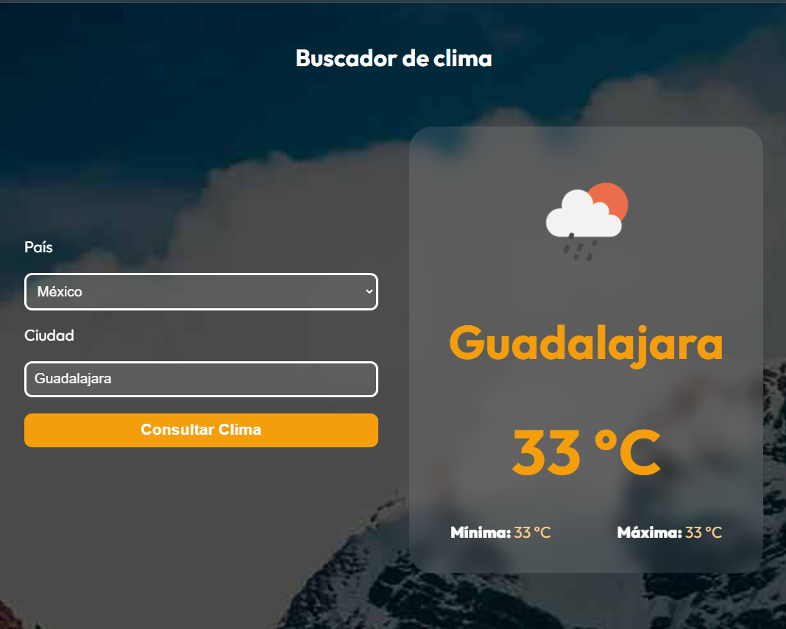

# Clima Mundial 🌍

](https://clima-mundial-jp.netlify.app/)

## Descripción del Proyecto

Clima Mundial es una aplicación web que permite a los usuarios consultar el clima actual de cualquier ciudad del mundo. La aplicación utiliza la API de OpenWeatherMap para obtener datos meteorológicos en tiempo real, incluyendo temperatura, condiciones climáticas y más.

## Tecnologías Utilizadas

- **React**: Biblioteca para construir interfaces de usuario.
- **TypeScript**: Superset de JavaScript que añade tipado estático.
- **Vite**: Herramienta de construcción rápida para proyectos modernos de frontend.
- **Valibot**: Utilizado para la validación y tipado de datos.
- **CSS Modules**: Para estilos encapsulados y reutilizables.
- **Axios**: Para realizar solicitudes HTTP a la API de OpenWeatherMap.

## Enfoque y Arquitectura

El proyecto sigue un enfoque modular y escalable:

- **Componentes Reutilizables**: Cada funcionalidad está dividida en componentes reutilizables como `Form`, `Spinner`, y `WeatherDetail`.
- **Hooks Personalizados**: Uso de hooks como `useWeather` para manejar la lógica de estado y las solicitudes a la API.
- **Validación de Datos**: Uso de Valibot para garantizar que los datos de la API cumplan con el esquema esperado.
- **Carpeta `public/`**: Contiene recursos estáticos como imágenes y archivos que se sirven directamente desde la raíz.

## Cómo Ejecutar el Proyecto Localmente

1. Clona este repositorio.
2. Instala las dependencias con `npm install`.
3. Crea un archivo `.env` en la raíz del proyecto y añade tu clave de API de OpenWeatherMap:
   ```env
   VITE_API_KEY=tu_api_key
   ```
4. Inicia el servidor de desarrollo con `npm run dev`.
5. Abre [http://localhost:5173](http://localhost:5173) en tu navegador.

## Enlace a Producción

Haz clic en la imagen para visitar la aplicación en producción:

[](https://clima-mundial-jp.netlify.app/)

## Licencia

Este proyecto está bajo la Licencia MIT.
